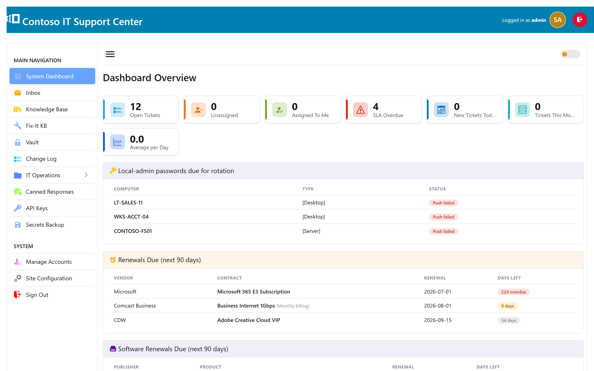
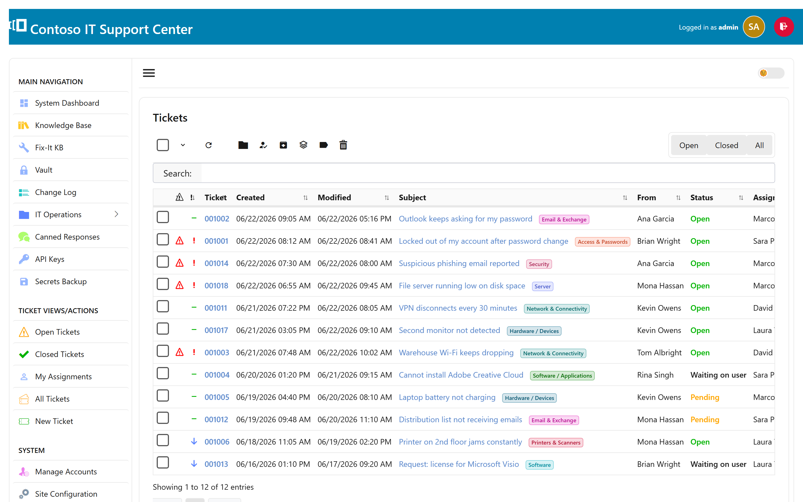
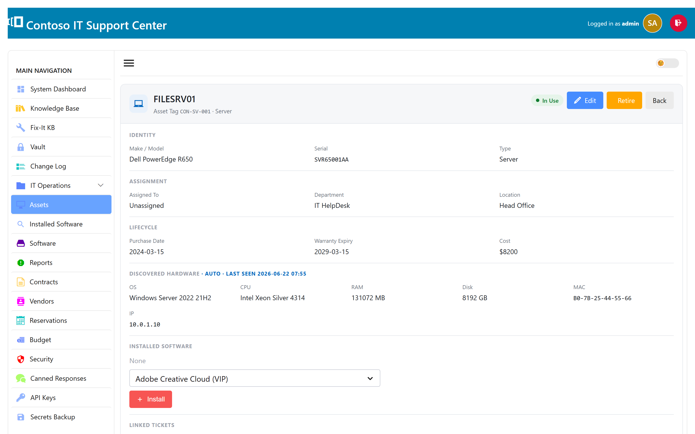

# SwanDesk ITSM

**Self-hosted help desk & IT asset management for Windows.** One installer, your server, your data — no cloud dependency, no per-agent SaaS fees.

SwanDesk is a complete IT service-management suite: email-driven ticketing, a knowledge base, hardware/software inventory, contracts, Active Directory integration, and more — running as a lightweight Windows service with a built-in web interface.

> **Free Community edition** — full ticketing on SQLite, no license key required. Upgrade to Professional / Premium / Enterprise to unlock inventory, MySQL, Active Directory, and more.

[**⬇ Download the latest release**](../../releases/latest) &nbsp;·&nbsp; [Live demo](https://demo.micropros.net:8444) (`admin` / `admin`) &nbsp;·&nbsp; [Documentation](https://micropros.net/swandesk/docs/) &nbsp;·&nbsp; [Website](https://micropros.net/swandesk/)

---

## Screenshots

<!-- Drop PNGs in docs/screenshots/ and update these links. The /swandesk/ gallery images work well here. -->

| Dashboard | Ticket inbox | Asset inventory |
|:---:|:---:|:---:|
|  |  |  |

## Features

**Ticketing**
- Email-to-ticket (IMAP), outbound SMTP, and Microsoft 365 (modern OAuth2 auth)
- Outlook-style inbox workspace, canned responses, ticket merge, CC handling
- SLA plans with due / overdue tracking *(Professional+)*
- Knowledge base — public, internal, and "fix-it" articles

**IT asset management** *(Premium+)*
- Automatic network discovery over WMI, plus a segmented network map
- Hardware & software inventory and software-license / audit tracking
- Contracts & renewals, vendors, and budgets

**Directory & security** *(Enterprise)*
- Active Directory login & user sync, plus password-expiry reminders
- LAPS — local-admin password rotation with a secure vault
- Encrypted credential / notes / file vault, and a read-only REST API
- Two-factor authentication and per-user roles

**Platform**
- Runs as a Windows service with a built-in web UI — no IIS required
- SQLite out of the box; MySQL / MariaDB for larger deployments *(Professional+)*
- Multi-language, custom logo/branding, and in-app update notifications

## Editions

| | Community (free) | Professional | Premium | Enterprise |
|---|:---:|:---:|:---:|:---:|
| Ticketing, knowledge base, email | ✅ | ✅ | ✅ | ✅ |
| Support reps | 1 | multiple | multiple | multiple |
| Database | SQLite | + MySQL / MariaDB | + MySQL / MariaDB | + MySQL / MariaDB |
| SLA plans, tags, change management, white-label | — | ✅ | ✅ | ✅ |
| Inventory, contracts, vendors, budgets | — | — | ✅ | ✅ |
| Active Directory, LAPS, vault, REST API | — | — | — | ✅ |

See **[micropros.net/swandesk](https://micropros.net/swandesk/)** for current pricing.

## Getting started

1. Download `SwanDesk-Setup.exe` from the [latest release](../../releases/latest).
2. Run the installer on a Windows machine — the setup is signed.
3. On first launch it creates a local SQLite database and starts the web service.
4. Browse to `http://<server>:<port>/` and sign in with the default **`admin` / `admin`** — then change it immediately.

Full setup guide: **[SwanDesk documentation](https://micropros.net/swandesk/docs/)**.

### System requirements

- Windows 10 / 11 or Windows Server 2016 or newer
- ~50 MB disk for the application (the database grows with your data)
- A modern web browser for the admin / agent interface
- *(Optional)* MySQL or MariaDB for Professional+ deployments

## Support

- 🐛 **Bug reports & feature requests:** [open an issue](../../issues)
- 📖 **Documentation:** https://micropros.net/swandesk/docs/
- ✉️ **Commercial support & licensing:** https://micropros.net

## License

SwanDesk is **proprietary software** © MicroPros (GNC Wholesale, LLC). The Community edition is free to use under the [End User License Agreement](LICENSE). This repository hosts the **installer, documentation, and issue tracker — not the source code.**
